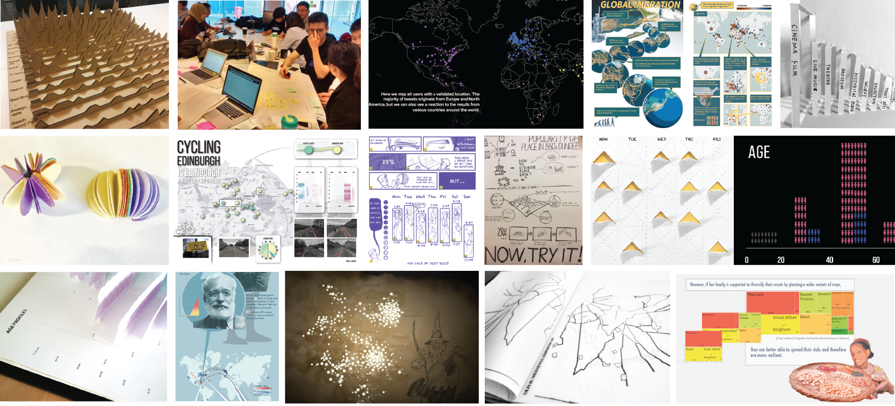

# Master Student Collaborations in Data Visualization 

## What is the Data Fair?

The data fair connects you with Master students in [Design Informatics](https://www.designinformatics.org/postgraduate/) to collaboratively work on data visualization projects from Sept-December 2022. We invite external partners to **share their real-world data with our students, collaborate on data analysis and visualization, and ideally end up with a project that you can share publicly**. The collaboration is open to everyone with data: individuals or organizations, academics or not. 

Check our [project outcomes from past years](previous.html).

We will held an open **info-session on Friday, Sept 16, 4pm on Teams** to discuss any questions you might have. [Click here to join the meeting](https://teams.microsoft.com/dl/launcher/launcher.html?url=%2F_%23%2Fl%2Fmeetup-join%2F19%3Ameeting_MmI5MTU0Y2MtNTBjOS00ZGNjLWI1YzEtOTY5Njk3ZGVjNGI3%40thread.v2%2F0%3Fcontext%3D%257b%2522Tid%2522%253a%25222e9f06b0-1669-4589-8789-10a06934dc61%2522%252c%2522Oid%2522%253a%25221c4cc21f-0698-4756-b656-1d9b7595893a%2522%257d%26anon%3Dtrue&type=meetup-join&deeplinkId=176f2e2d-af28-4e37-92ae-bfd2b429a881&directDl=true&msLaunch=true&enableMobilePage=true&suppressPrompt=true), 9Cm9Vy.

The goal for the students is to chose a real-world dataset and an associated challenge for their course _Data Science for Design_ that runs from October to December. Within that course, [students will learn the basics of data analysis and visualization](teaching.html). Their assignment requires them to analyze a real-world data set and work on a visualization project that **focuses on data exploration and the communication of findings** through data visualization. Students will work in groups of three. Projects from past years can be found [here](previous.html).

[In case of large numbers of project submissions, we prioritize projects in the area of climate action and the [UN Sustainable development](https://sdgs.un.org/goals).](https://sdgs.un.org/goals)

## Why should I participate?
You will have the chance to work with motivated and creative students from a variety of backgrounds: graphic design, media, computer science, product design, etc. You will **define a data challenge**, i.e., an **urgent problem or project you require help with** around data analysis and visualization. You are invited to work with the students as close as you wish and attend our lectures and lab sessions (Thursdays 9am-1pm).

**We hope that novel collaborations between you and the students and us will emerge**. In the following semester (Jan-April), students towards their masters project in the summer; if the data fair project works well, there you are welcome to propose further projects and collaborate on supervision.

## How can I participate?
The commitment from your side will be:

1. [**Submit a data brief** and data challenge before September 23rd by filling this form (approx. 5-10min)](submit.html). Please, also read 
[How to write a good Data Challenge?](datachallenge.html)
1. We will get in touch with you to inform you whether a participation in the data fair is a good choice for you, or whether your data is too complicated or otherwise students will not be able to help you.
3. You **should present your challenge in 3min on Thursday, 29th September 2021, 10:30am, at InSpace, Informatics Forum (Edinburgh)**: pitch your data brief for 3min, with the support of slides and any other material you would like to show and ideally **stay for 1-2h to discuss with students**. We organize a speed-dating session, then we will  have an open discussion between you and the students. In case you cannot attend this event, leave a note in your data brief and we will contact you. You can bring along any colleagues you wish. 
4. Then, students have 2 week to decide on a challenge. Make it easy for students to decide for your challenge.
5. Once they have chosen a challenge, you shold **provide your data to students by mid October** in an accessible format (e.g., a CSV, Excel, Online API, data base dump) and eventually help them get going. If you need, we can sign non-disclosure contracts. However, data and respective visualizations and analyses will still be visible to other students on the course and the course organizers and tutors for marking and feedback.
6. During the semester, you **consult with the students as much or little** as you want and you're welcome to attend our lectures and lab sessions.
7. Students will get regular feedback from tutors and course organizers on their project in the form of discussions and marking feedback.
8. **Students will first submit a report on the data analysis** (~November 6th, 2021). **Then will work on a final visualization project.**
9. Final presentations will happen on **December 1st 2022**, same location. Students are required to deliver their python code and an extensive data report with measures and visualizations. You are welcome to attend this event and give public feedback. 

## What are students doing with my data?

### Analysis report

Students have 3 weeks to come up with an an individual analysis report (each student, hence 3 per group). Each report consists of an [IPython notebook](https://ipython.org) that includes python code and results of an exploratory analysis. Each report should investigate something different and will contain:

1. 4-5 exploratory data visualisations, presented in a readable way and provided with explanation about what you have found: e.g., distributions, relationships, correlations, simple statistics, etc.
1. 1-2 relationships between variables analysed: Trends, outliers, clusters, some high-level statistics.
1. 2-3 hypotheses for further investigation

### Visualization project

After these three weeks, students have 3 weeks to come up with some engaging form of presenting the data (group work). This end-piece should help communicating insights from or around the data to a specific audience. This will be shaped by what you think makes most sense for you and the data, but the students will have the final say over their brief. Some outputs might be:

* An interactive web site
* Interactive visualizations on a website
* [Data comics](http://datacomics.github.io)
* Infographic
* [Physical data visualization](http://dataphys.org/list)
* Data visualization in mixed reality 
* Data video
* A standard scientific presentation / report. 
* anything else that might address your challenge.

## Course Organizers:
* [Dr. Benjamin Bach](mailto:bbach@ed.ac.uk), Reader in Design Informatics and Visualization, School of Informatics [http://visualinteractivedata.github.io](http://visualinteractivedata.github.io)
* Dr. Lynne Craig, Senior Lecturer, Design, Program Director Design Informatics, Edinburgh College of Art [https://www.linkedin.com/in/lynnemurrayprofile/](https://www.linkedin.com/in/lynnemurrayprofile/)
