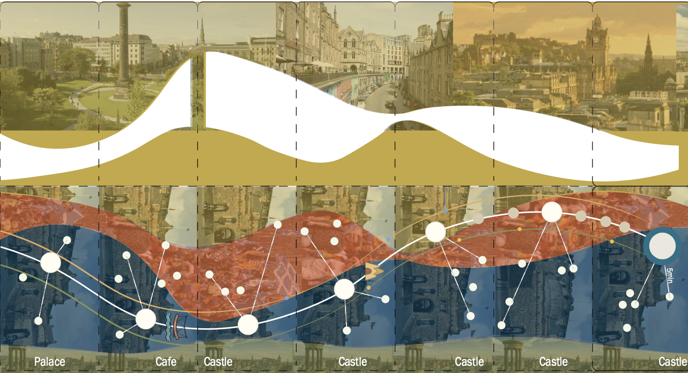
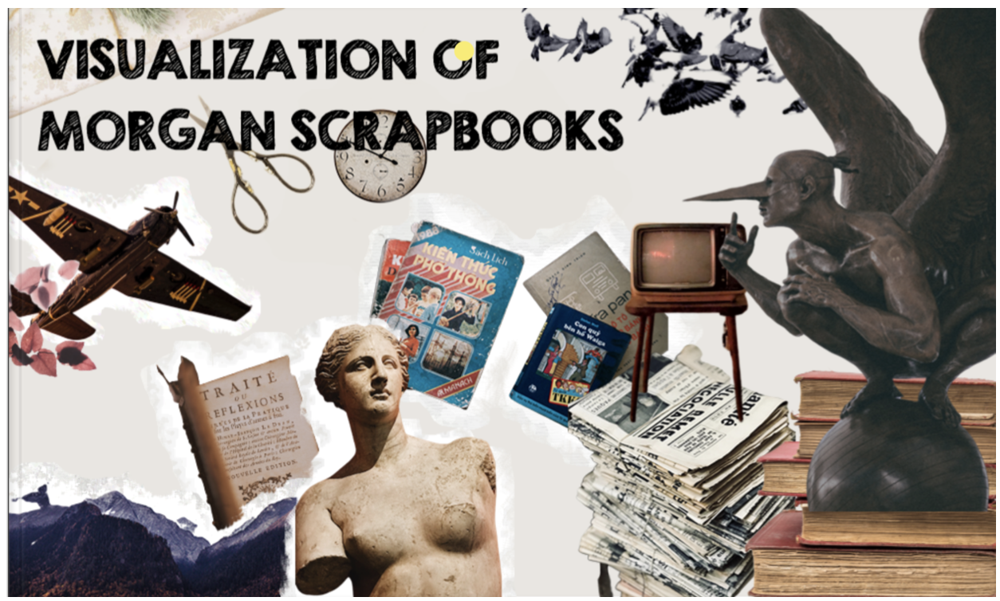
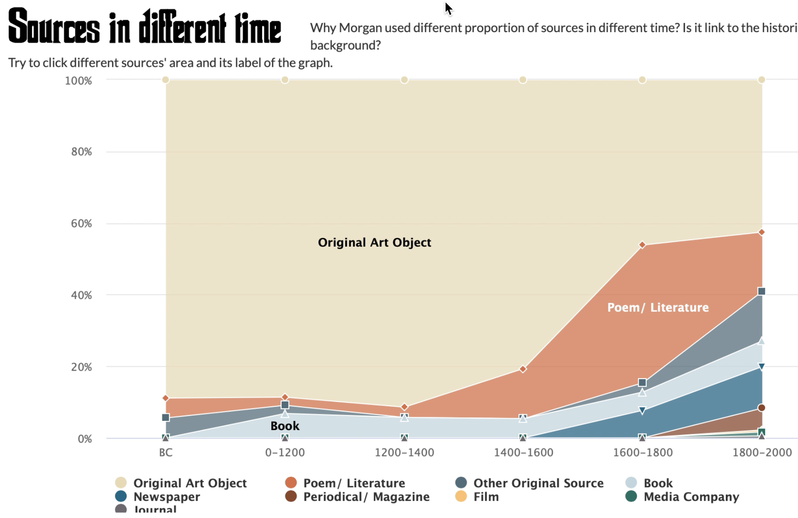
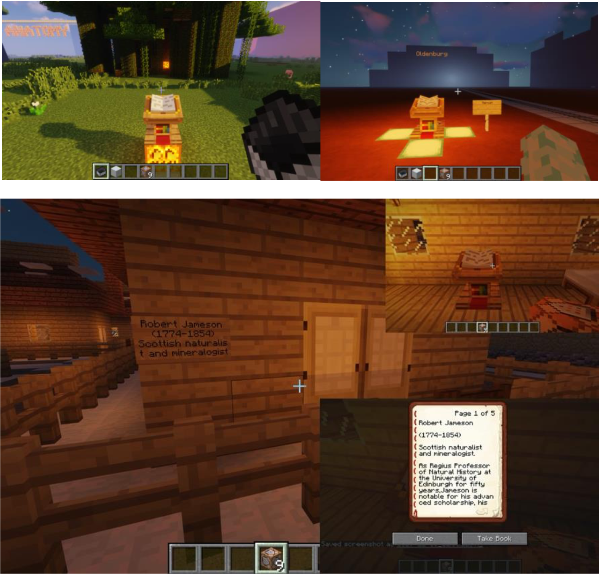
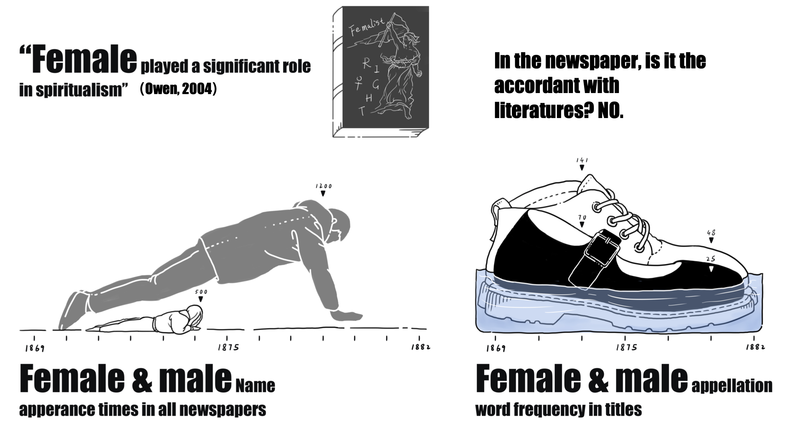
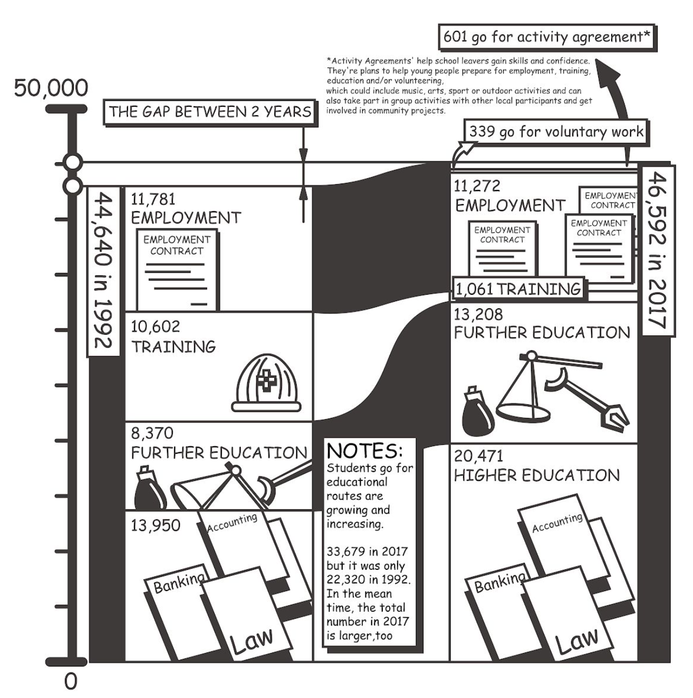
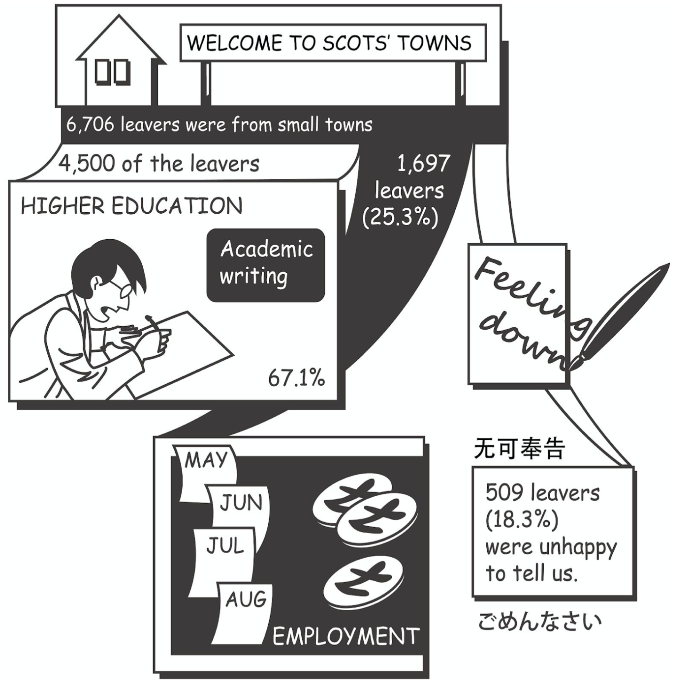

# Past Data Fair Projects

## An Interactive Digital Newspaper Visualizing the Spiritualist Movement in 19th century

As people are so used to targeted reading, we feel reluctant to read faced with large textual 
data. The social movement records are buried in the dust of history. How to preserve these 
stories and present them to people in the original style has become our focus. Our group used 
the NLTK toolkit in python to analyse textual data and used quantitative data as evidence to 
guide and support our reading in the complete dataset. We combine our findings and present 
an interactive digital newspaper to break down the barrier for the public to get an overview of 
the 19th century Spiritualist Newspaper. Through the coursework we unpacked how 
visualization techniques can help humanity studies and deepened our understanding of the 
visualization process.

_Wangjun Qian, Jinrui Wang, Rong Jin, Youwen Zhang, Jingyu Zhou_ 

## Encyclopedia Britannica (2021)

Our project is an interactive projection installation of Encyclopaedia Britannica. Since 
we got datasets from the National Library of Scotland, and found that it has 8 editions of 
195 volumes, which is difficult for people to find information they need. For the sake of 
enhancing the Encyclopaedia Britannica’s readability, interactivity and enjoyment, we try 
to find specific relationships in it and use creative methods to immerse audiences in 
reading.

_Keren He, Shijie Chen, Dake Wang, Qiuyue Ding, Yuhan Ma_

## Green Light Electric Vehicle (2021)

This project is situated in the context of Germany’s emission reduction targets. IT analyses the changes in Germany’s overall carbon emissions and 
those of the transport sector. It also compares data about Light Electric Vehicles (LEV) and traditional fuel vehicle (TFL) to create an interactive comic website and to order to offer more information about the difference in those two types of vehicles. The interactive comic aims to raise the environment protection awareness of users who want to buy a car and motivate them to buy LEV vehicle, which will increase the transport sector's role in 
reducing emissions.

_Shiqing Zhou, Xinyi Cao, Jinger Fu, Jia Guo, Hong Zhang, Larisa Deng_

## La Goccia Urban Forest in Milan (I) (2021)

Our group analysed tree data and geographic information in an urban forest in one part of Milan. The tree data was visualized through geographical modeling of the areas involved and by abstracting multiple trees from the plot site into a single tree. We built a physical model of the site with trees visualizing those data captured about the specific area in the urban forrest: tree species, growth rate, diameter, biodiversity, etc. 

_Yue Zhang, Xinrui Yang, Shulong Zheng, Yucheng Cai, Chenjun Du_

## La Goccia Urban Forest in Milan (II) (2021)

La Goccia, located in Milan between the Bovisa and Villapizzone districts, known as 
the gas meter zone, is a hidden place filled with more than 2,000 precious trees. 
Decades ago, this vast expanse of green space was occupied by defunct factories, 
which have been waiting since ancient times to repair pollutants produced by 
industry. The data supporting this project was collected from part of a project called "As 
Infrastructure (https://treesasinfrastructure.com/). 

In this project, we have chosen to reach more local citizens and use the 
website as a powerful way to reawaken their awareness of the many values of trees 
in a relaxed and enjoyable way. 

_Chengyu Wu, Ziao Tang, Pinhua Wang, Zoe Yi, Lidan Xiang, Yuxuan Chen_

## Cultural Maps (2019)

Our study seeks to create a cultural map for tourists or locals in the City of Edinburgh that encompasses both the main cultural assets available and incorporates additional aspects such as demographic information, ethnicity and religious organisations, monuments and open spaces. A key challenge was to present (in a digestible way) what is an extremely rich dataset with enough depth to maintain the integrity of relationships but that could span the entire city to allow deep insights across different areas.

To experience the nodes that form the cultural sites in a human way, we therefore struck on the idea of using the transport network - the main arteries that help people travel through the city - as a way to effectively slice through and expose the depths of the dataset. Selecting a particular Lothian bus route (#16), we analysed religious, demographic data and cultural sites with proximity to bus stops along that line. This enables us to transcend the city and delve into the various flavours and influences appearing in very different but quite localised areas.

_Shixuan Wang, Linrui He, Yifan Zhou and Karen Mair, 2019_

## Edwin Morgan's Scapbooks  (2019)

Edwin Morgan was the first national poet in Scotland, and he wrote many influential poems in his life. In addition to the poems he left to the public, he also produced 12 scrapbooks during his entire life and these scrapbooks are valuable biographical materials for people to learn more about Morgan and the time he lived. the metadata about the scrapbooks was collected and our project is to utilize the metadata to visualize the scrapbooks and allow the public to know what are in the scrapbooks without viewing the original books. The data we have for the project are 4 of overall scrapbooks that were produced from the 1930s to 1960s.

_Kun Wang, Yongrao Du, Kehan Jiao, 2019_

[Web](https://s1879569.wixsite.com/encyclopaedia-group1) | [Video](https://youtu.be/8OCITifn-FA)

## Encyclopedia Britannica (2019)

The dataset is the Encyclopedia Britannica from edition 1 to edition 8, released by National Library of Scotland. The uncleaned OCR dataset contains 155,388 ALTO XML files, 155,388 image files, and METS metadata files. To show the data to general public who is our target audience, we built a fancy world of Encyclopedia in Minecraft containing four main parts of our finding in data analysis, enabling people have similar experience as they are exploring in a museum.

_Bibo Tian, Xue Feng, Yifeng Gao, 2019_ 

## Cancer Data (2019)

This project is a data visualization project on cancer data in England. In this project, researchers analyzed data from Simulacrum, gained insights into cancer incidence, mortality rates, etc. Eventually, the project designed data visualizations to deliver these insights. The design outcome involves a data comics and paper engineering.

Traditional paper engineering works such as pop-up cards and books us the element of surprise to delight and amaze audiences at all age levels. Pop-up books could be printed in large numbers using cheap materials. 

_Chen Chen Jiayu Li Ziying Li, 2019_

## Diseases in British India from 1850 to 1950 (2019)

The dataset is about visualizing the disease in British India from 1850 to 1950 and collects 468 official publications of short reports to multi-volume histories relating to disease, medical research, official institution report response to epidemics within a colonial context, consisting of 120,903 images, 469 TXT and 117,490 positional XML.

Our data visualization are supposed to be applied in a historical, or medical museum. It also can be used for introducing popular science to those who are interested in colonial India history. These visualisations of these historical data helps to have a better understanding of the prevalence of ancient Cholera.

_Qbin Wu & Diwen Yu, 2019_

## Spriritualist Newspapers (2019)

Spiritualism is a religious movement started in the half of the nineteenth century and based on the belief that “human’s consciousness survives corporeal death by maintaining a transcendent existence in a spirit world” (Valente, 2008). It started in New York in 1848, spreading to British in the 1850s and reached its peak growth in membership from the 1840s to the 1920s, especially in English-speaking countries(Braude,2001). In 1969, the newspaper titled “ the spiritualist” was published in London and issued in other countries in the next 13 years.

Methods of Natural Language processing are used to conduct data analysis and the analyzed result will be visualized in the form of data comic. 

_Xin Jin, Hang Yang, Ruyuan Zhang, 2019_

## Inequality in Scotland (2019)

Our dataset is about social inequality in Scotland, including higher education, further education, training, employment, voluntary work and activity agreements. We used data comics to present our findings, and we found that the diversity of positive destination has increased. 

_Bowen Qian, Guanyu Chen, Shiyu Wang, 2019_

## Scottish Witchcraft (2018)

This project is about understanding and visualising the Survey of Scottish Witchcraft database. The database is a documentation of all known information about accused witches and the witchcraft belief in Scotland between 1563 and 1736 (The University of Edinburgh, n.d.). The database is a Microsoft Access database owned by the School of History, Classics and Archaeology of the University of Edinburgh.

Our group created a physicalisation which is an interactive physical map and objects that audiences can interact with. The piece aims to educate audiences with the history of the Scottish witchcraft including the general distribution of accused witches by gender and location as well as the different torture types by location. Our audiences can be anyone that is interested in the Scottish Witchcraft history.

[Video](https://media.ed.ac.uk/media/An+interactive+laser+cut+map+of+accused+witches+in+Scotland/1_wn428698)

## International Trade Agreements (2018)

For this work we have been using data visualization as a means to gain insight into the underlying structure and relationships of international trade agreements. Our dataset is comprised of 450 preferential international trade agreements with the majority (424) being in english. The original dataset is open to the public and can be found [here](https://github.com/mappingtreaties/tota). 
[Website](https://ollieford.github.io/DS4D-Trade-Agreement-Project), [Download the DH2019 poster](https://dev.clariah.nl/files/dh2019/posters/0949.pdf)

## Visualising NHS Scotland Patient Care Experiences (2018)

This project created an interactive visualisation that allows the user to explore differences in patient experiences across Scotland. The Scottish government collects data on healthcare experiences through a biannual survey, but they typically publish this data in lengthy reports and large tables, making it difficult for laypeople as well as policymakers to use the data. In our project, we tried to make this data more accessible by creating visualisations. 

[Website](https://sarah37.github.io/ds4d-project/vis/)

## Utilising FIFA Data to Visualise Team Formations (2018)

The aim of this project is to analyse FIFA World Cup 2018 Qualifiers data and provide useful insights via data visualisations. We implemented this project by developing a web platform that allows users (soccer experts, managers, scouts, etc.) to generate customised visualisations in order to understand the data and extract non-trivial information. The idea behind our implementation is to produce clean and easy to follow plots that can be potentially used by the soccer domain experts to make analyses of opponents’ playing styles, formations, strengths and weaknesses, etc. 

The main page of the visualisation displays a high-level overview of the data, using glyphs to symbolise inequality — the less round, the more difference in the reported experiences of patients. Clicking the glyphs takes the user to a heatmap displaying the reported experiences for overall themes and optionally for individual survey questions. This setup allows the user to control how much detail is being shown.

[Website](https://dfd-fifa18.herokuapp.com/fifa18) (2018)

## Testimonials

_"I would never have been able to get data visualisations of my work without this project; now I have them, I can use them for future funding applications and demonstrate the implications of data-led historical study"_

_"We had a very positive experience working together as a team to build such a tool. We also benefited from our collaboration with Dr Campagnolo, as he provided useful and specialised knowledge around the given data set, which contributed to us creating a tool that can be very useful to the domain’s experts since Dr Campagnolo is one of them himself. Lastly, we were grateful for having the opportunity through this course to work on such a project, as this equipped us with experiences which will be definitely useful for our further academic or professional careers."_

