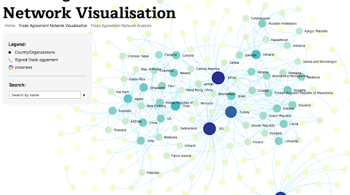
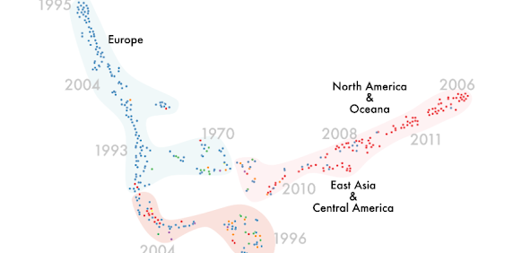
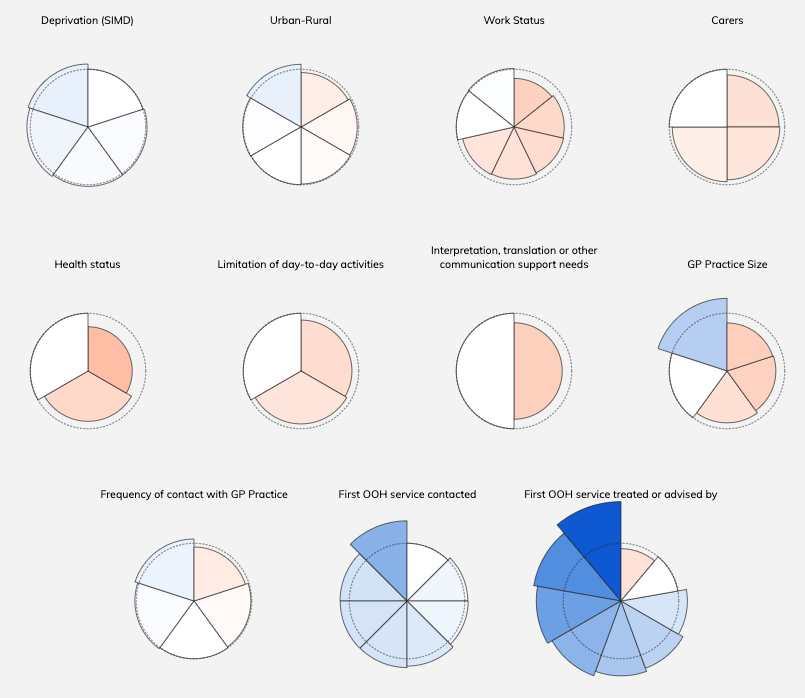
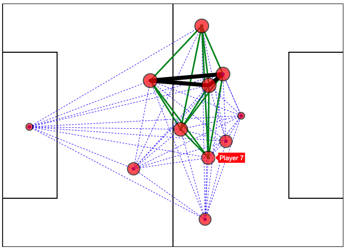

# Previous Data Fair Projects

## International Trade Agreements

For this work we have been using data visualization as a means to gain insight into the underlying structure and relationships of international trade agreements. Our dataset is comprised of 450 preferential international trade agreements with the majority (424) being in english. The original dataset is open to the public and can be found [here](https://github.com/mappingtreaties/tota). 
[Website](https://ollieford.github.io/DS4D-Trade-Agreement-Project), [Download the DH2019 poster](https://dev.clariah.nl/files/dh2019/posters/0949.pdf)

## Visualising NHS Scotland Patient Care Experiences

This project created an interactive visualisation that allows the user to explore differences in patient experiences across Scotland. The Scottish government collects data on healthcare experiences through a biannual survey, but they typically publish this data in lengthy reports and large tables, making it difficult for laypeople as well as policymakers to use the data. In our project, we tried to make this data more accessible by creating visualisations. 

[Website](https://sarah37.github.io/ds4d-project/vis/)

## Utilising FIFA Data to Visualise Team Formations

The aim of this project is to analyse FIFA World Cup 2018 Qualifiers data and provide useful insights via data visualisations. We implemented this project by developing a web platform that allows users (soccer experts, managers, scouts, etc.) to generate customised visualisations in order to understand the data and extract non-trivial information. The idea behind our implementation is to produce clean and easy to follow plots that can be potentially used by the soccer domain experts to make analyses of opponents’ playing styles, formations, strengths and weaknesses, etc. 

The main page of the visualisation displays a high-level overview of the data, using glyphs to symbolise inequality — the less round, the more difference in the reported experiences of patients. Clicking the glyphs takes the user to a heatmap displaying the reported experiences for overall themes and optionally for individual survey questions. This setup allows the user to control how much detail is being shown.

[Website](https://dfd-fifa18.herokuapp.com/fifa18)

## Testimonials

_"I would never have been able to get data visualisations of my work without this project; now I have them, I can use them for future funding applications and demonstrate the implications of data-led historical study"_

_"We had a very positive experience working together as a team to build such a tool. We also benefited from our collaboration with Dr Campagnolo, as he provided useful and specialised knowledge around the given data set, which contributed to us creating a tool that can be very useful to the domain’s experts since Dr Campagnolo is one of them himself. Lastly, we were grateful for having the opportunity through this course to work on such a project, as this equipped us with experiences which will be definitely useful for our further academic or professional careers."_

